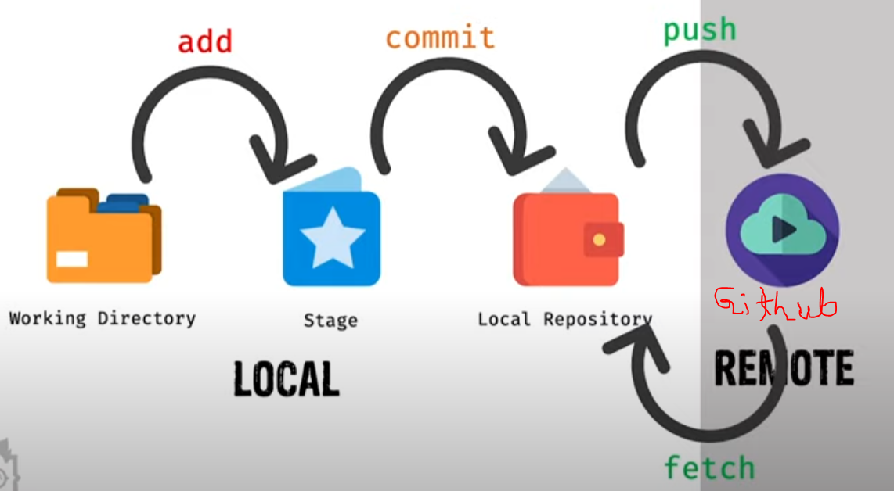

# command for git:

### Make directory/ folder: 
                                                            mkdir [folder name]
### See all the file or folder in a directory(for windows):
                                                            dir
### See all the file or folder in a directory(for ubuntu):        
                                                            ls
### See all the file or folder in a directory(for mac):        
                                                            ls
### Make file:                                              
                                                            touch [file name with extension]
### initialize a directory as git directory:          
                                                            git init
### change directory:
                                                            cd [folder name]    
### go back: root directory:                                          
                                                            cd ..


#################################################################################

### Cloning an online repository: 
                                                            git clone [repository URL]
### see what changed in the directory: 
                                                            git status 
#################################################################################
# local working directory to --> stage
### if we want too add all to stage--> good practice--> go to root folder and :
                                                            git add .
### Add from local directory to to git stage (all changes "--all"):
                                                            git add --all
### or 
                                                            add -A
### Add from local directory to to git stage only the contents in the folder we are currently located (all changes "--all"):
                                                            git add .
### Add from local directory to to git stage new changes without deleted changes (all changes "--all"):
                                                            git add *
### Add from local directory to to git stage (only selected files):
                                                            git add [file_name.extension]
                                                            if it won work then put a '.' before file_name
                                                            git add .[file_name.extension]
### Add from local directory to to git stage (only selected files in a perticular folder):
                                                            git add [folder_name/file_name.extension]
                                                            if it won work then put a '.' before file_name
                                                            git add .[folder_name/file_name.extension]
### Add from local directory to to git stage (only specific extension files):
                                                            git add [*.extension]
### (undo add) Take back, stage to local directory(all changes "reset"):
                                                            git reset
### after deleting a file if I add, and now if I want to Undo the add and I want to take back the deleted file too then:(need to make hard reset '--hard', this is called: reset with hard flag)
                                                            git reset --hard
#################################################################################

# commit
### Commit : 
                                                            git commit -m "[comment]"
### (Undo commit) take back, stage to local (all changes "reset"):
                                                            git reset HEAD~

#################################################################################
### delete/ remove a file, and add the changes to stage:( rm = remove)
                                                            git rm [file_name.extension]
### Now if I made any changes and before commiting the change, if I want to delete the file then it ont work by simple rm command
### If I want to delete that file frocefully then I Have to include '-f' flag, which means frocefully remove
                                                            git rm [file_name.ext] -f
### If I want to delete that file and make it staged, but don't want to delete the acctual file from local directory then I need to use a flag '--cached'
                                                            git  rm --cached [file_name.ext]
### remove folder: 
                                                            git rm [folder_name]
### remove folder: recursivly 
                                                            git rm -r [folder_name]   
#################################################################################   
# Branching 
### how many branches are there? 
                                                            git branch
### create new branch:
                                                            git branch [branch_name]
### switch to another branch:
                                                            git checkout [another_branch_name]
### switch to main_branch:
                                                            git checkout main
#################################################################################   
# Marging 
### Lets assume we have different changes in 'new' branch and 'main' branch (commited changes)
### first we need to merge 'main' with 'new'.(main--> new) 
### checkout or switch to 'new': Now we are in "new" branch
                                                            git checkout new
                                                            git merge main -m "[comment]"
### Now, checkout or switch to 'main' branch: Now we are in "main" branch
                                                            git checkout main
                                                            git merge new -m "[comment]"
 
#################################################################################   
# Marging conflict --> change in same file
### suppose we have 'main' branch and 'new', 'new2'  branches
### if both 'new' and 'new2' has a file name called '2.txt'
###  if 'new' made a change on that file in first line (suppose written : '2' )
###  if 'new2' made a change on that file in first line (suppose written : 'two' )
### Now if we try to merge the it git will throug conflict issue
### Now lets say, we are in 'new' branch, now we are marging with 'new2':(new2--> new)
                                                            git checkout new
                                                            git merge new2 -m "[comment]"
## conflict will appeare: (Now we need to solve the conflicts)
### now if we stay in 'new' and go to the '2.txt', we will see, someting like this:
```
2                              2                      two
=====     --> we can do -->         --> or --> 
two
```
### now we can make it same and merge again 
                                                            git checkout new
                                                            git merge new2 -m "[comment]"
### then merge main--> new/new2
                                                            git checkout new
                                                            git merge main -m "[comment]"
### then finally merge into main. (merge: new-->main)
                                                            git checkout main
                                                            git merge new -m "[comment]"

################################################################################# 
# push
### checkout or switch to the branch where we wannet to push:then,
                                                            git checkout [branchName]
                                                            git push origin [branch_name]
### example
                                                            git checkout main
                                                            git push origin main

################################################################################# 
## fatch 
                                                            git fatch
### after fatch we won't see the changes in our local machine 
### to see the changes in local machine we need to merge
### so merge:
                                                            git merge
### OR WE can simply pull(pull = fatch + merge)
                                                            git pull
################################################################################# 

